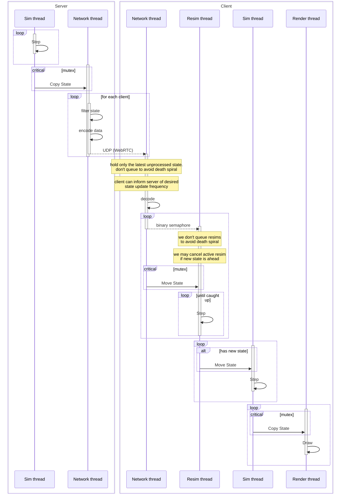
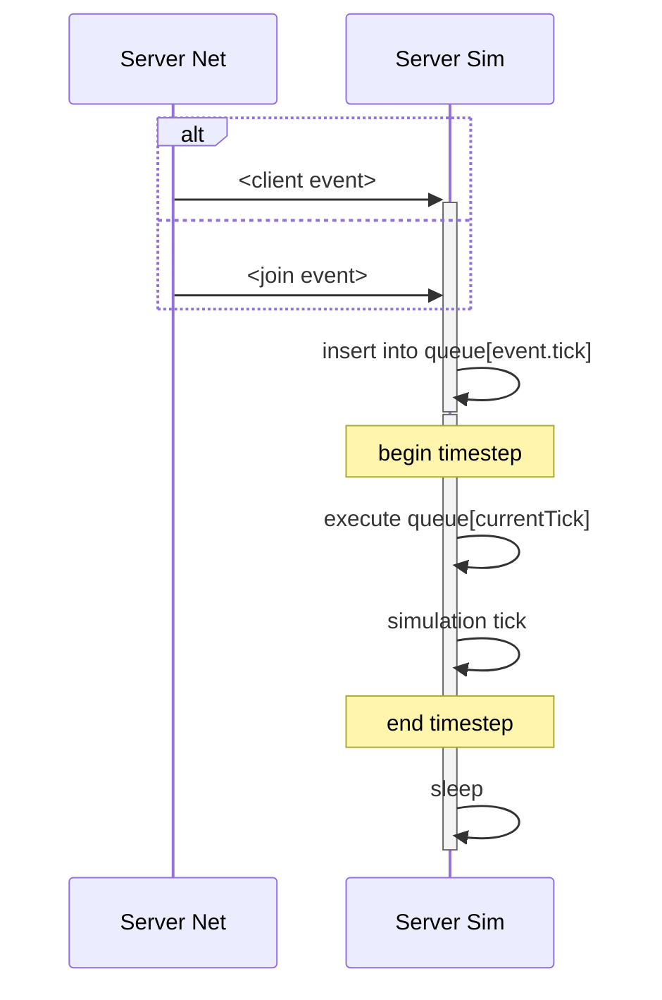
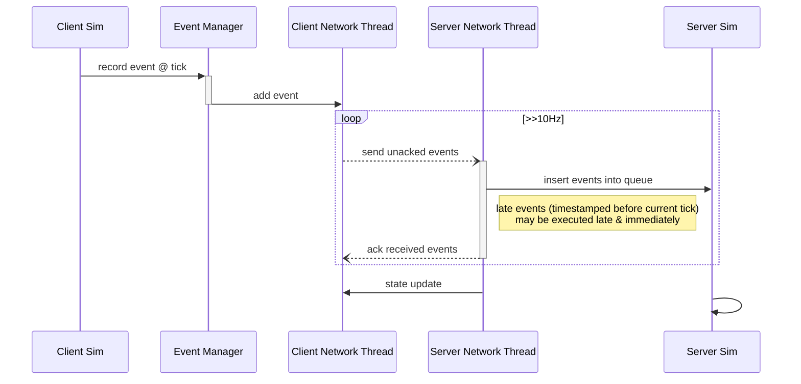
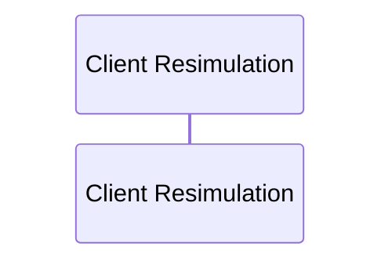
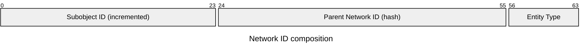

```mermaid
sequenceDiagram
participant Input@{ "type": "boundary" }
participant c as Simulation
participant e as Event Manager
%% participant et as Client Network Thread
%% participant s as Server

activate c
%% loop
Input->>c: <input>
note over c: begin timestep

loop
activate c
c-->>c: process input
c->>e: record event @ tick
activate e
deactivate e
deactivate c
end

c->>c: execute event queue
c->>c: simulation tick

note over c: end timestep
c->>c: sleep
%% end
deactivate c
```

# Netcode Architecture


## Rollback/Resim

<!-- <details>
<summary>Sequence Diagram</summary> -->



<!-- </details> -->

## State Updates

### Definition

```cpp
using EntityID = uint64_t;
using EntityType = uint8_t;

struct EncodedEntityState {
    EntityID id;
    EntityType type;
    vector<byte> data;
};

struct EncodedStateMessage {
    uint64_t tick;
    vector<EncodedEntityState> entityStates;
};
```

### Encoding
```cpp
// Server tracks filtered state
map<ClientID, set<EntityID>> clientTrackedEntities;
// ...
for (entity : Entities) {
    // State filtering
    if (shouldInclude(entity, clientID)) {
        encode(&buffer, entityID); // cached
    }
}
// ...

// Client ack
clientTrackedEntities[clientID].insert_range(clientAck.ackedEntities)
// ...

void encode(EntityID entityID) {
    if (encodedCache.contains(entityID)) {
        return encodedCache[entityID];
    }

    EncodedEntityState state = ...; // serialize

    encodedCache[entityID] = state;
    return state;
}
```


## Events

Types of events:
- User input
- Server events (such as player joins)


<table style="width:100%">
<tr>
<th>Client Loop</th>
<th>Server Loop</th>
</tr>
<tr>
<td>



</td>
<td>



</td>
</tr>
</table>


### Event synchronization


```cpp
struct EventAck {
    uint32_t id; // unchanging for continuous data, server discards old? discrete events unique id?
    uint64_t tick; // accepted timestamp
    // WIP
}

struct EventsAckMessage {
    vector<EventAck> eventAcks;
    vector<map<Tick, Event>> futureEvents; // other players may be ahead?
};
```

### Event resimulation



## Network IDs

- An **entity** is a severable set of state that can be created or deleted during simulation.
- A **behavior** operates on entities, but contain no state.
- A **renderer** is a client-only unit of state & behavior, linked to an entity.
    - A renderer must be robust to time skips to avoid jarring UX.
        - Audio shouldn't skip (unless precise timing is critical to gameplay)
        - Animations should be linked to timestep
        - Spatial transform should consider smooth interpolation
- Entities must contain an id to match to a renderer.
- The network_id must be deterministic, or else state corrections will invalidate renderers.

### Naive network ID generation

The most basic solution to deterministic network IDs is to use a global monotonically increasing counter,  
e.g. `network_id = next_network_id++;`

However, this solution is likely to create mismatching IDs between the server state and the client prediction state due to client prediction errors. This can cause issues such as:
- Renderers tied to incompatible entity types
- Meshes rapidly swapping position, visible due to physics interpolation
- Painfully visible incorrect particle trails
- Sudden changes in animation state

Mismatch occurs with the monotonic counter due to entity reordering:  
e.g. A -> B -> C  
v.s. A -> X -> B -> C  

#### Common scenarios:
1. Remote player input event causes entity creation reordering.  
e.g. A bullet was fired.
2. Unpredictable server event causes entity creation reordering.
3. Misprediction due to nondeterminism (such as compiler instruction ordering) or imprecise client state (network compression).  
e.g. A bullet breaks a boulder into several new rock entities, but narrowly misses on the client.
2. Misprediction due to incomplete client state (state filtering).  
e.g. The client didn't even know there was a boulder.

### Context-dependent IDs

The solution to non-conflicting IDs is to use as much context as we can to define the ID. The simple global monotonic counter approach requires context of the entire simulation, which we know is shared neither completely nor precisely between client and server due to local state pruning and lossy compression. We can do better by providing more robust sources of context to ID generation.

```cpp
state.addBulletEntity(params...);  // no context, use `next_network_id++`
```
```cpp
// `context` can be defined more robustly to solve this problem
state.addBulletEntity(context, params...);  // `network_id = f(context);`
```

> _Thinking about this, I think there is a more generalized way to use these params as the context. The issue is that we cannot match entities bit-for-bit, but we could perform some matching algorithm using datatype-conscious similarity._

We can assemble the network ID using three chunks:
- 8 bits to group by the entity type
- 32 bits identifying a "context" (parent entity ID)
- 24 bits capturing the context-local incrementing counter (subobject ID)



#### Entity Type

We can trivially group entities by type. This completely eliminates any risk of type mismatch.

#### Subobject ID

Most creation behavior is tied to the context of an existing object or to global events of the server. We can add a subobject counter to each entity state (easily compressed away for objects that don't use it) that we increment for every use.

Objects created exclusively by the server (not predicted), such as new players, can use a reserved server context ID of zero.

```cpp
uint64_t Game::generateNetworkID(uint64_t context_id = 0, uint8_t entity_type_id = 0) {
    uint32_t *subobject_id_counter = &server_subobject_id_counter;
    if (context_id) {
        subobject_id_counter = &(getEntityState(context_id).subobject_id_counter);
    }
    uint32_t subobject_id = (*subobject_id_counter)++;
    return (entity_type_id << 56) | (hash(context_id) << ) | (subobject_id & 0xFFFFFF);
}

// Server only
void Game::addPlayerEntity(<params>) {
    // ...
    player.network_id = generateNetworkID(0, 0); // entity type not technically needed
}

// Both client and server
void Game::addBulletEntity(uint64_t player_id, params...) {
    // ...
    bullet.network_id = generateNetworkID(player_id, BULLET_TYPE_ID);
}
```

