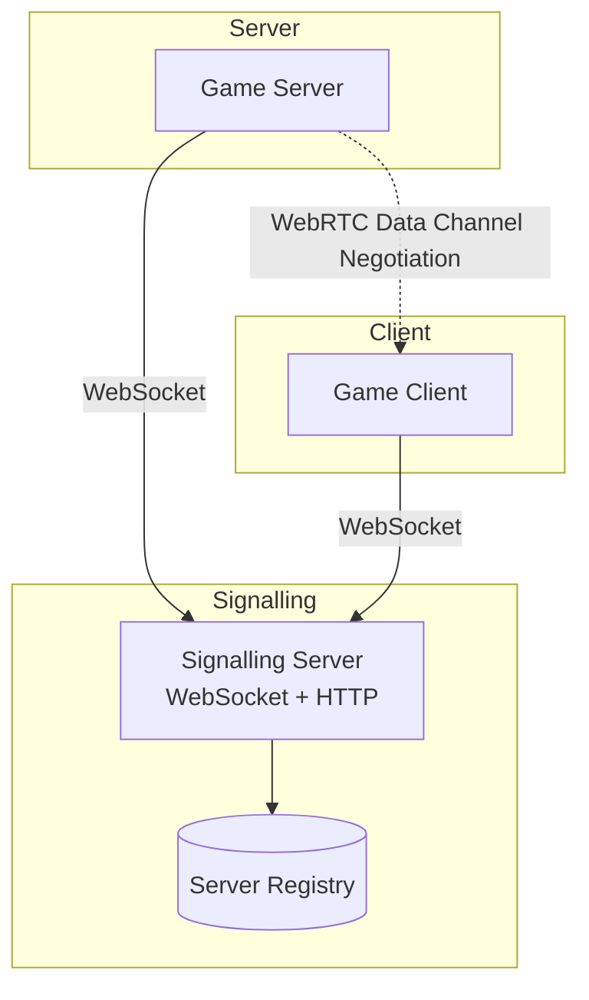
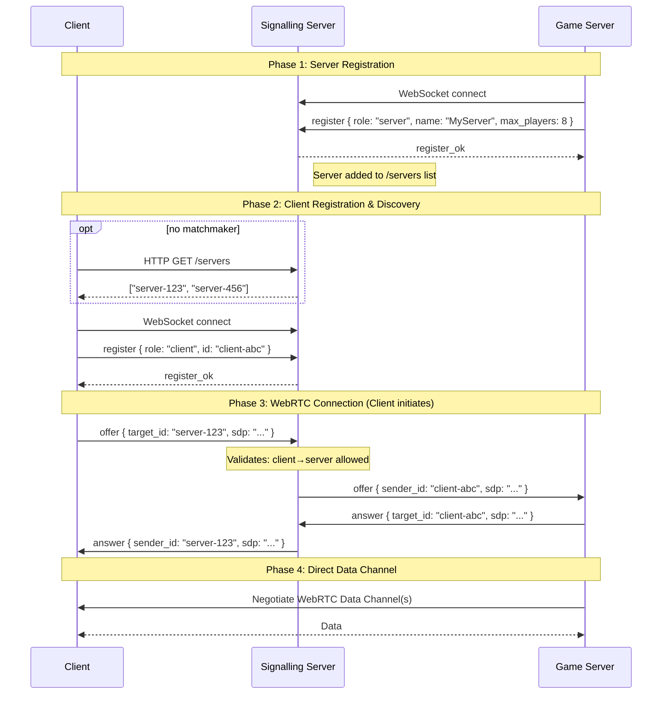
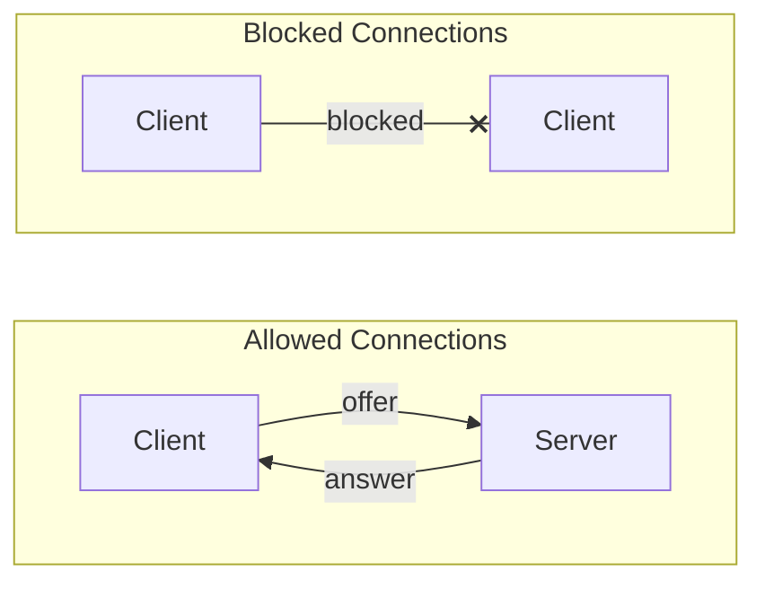

# Signalling Server Architecture

## Overview

The signalling server is a Go-based WebSocket relay that facilitates WebRTC connections between game clients and game servers. It uses a role-based registration system to control which peers can connect to each other.

**Key properties:**
- Game servers are publicly discoverable via HTTP `/servers` endpoint
- Clients are hidden (never listed)
- Client-to-client connections are blocked
- Only client-to-server and server-to-client connections are allowed
- WebRTC data channels provide low-latency transport after signalling

## Architecture Diagram



## Registration Protocol

### Message Format

All messages are JSON-encoded:

**Registration (first message after WebSocket connect):**
```json
{
  "type": "register",
  "id": "unique-peer-id",
  "role": "client" | "server",
  "name": "server-name",         // optional, server only
  "max_players": 8,              // optional, server only
  "game_mode": "deathmatch"      // optional, server only
}
```

**Offer (initiate connection):**
```json
{
  "type": "offer",
  "target_id": "peer-id-to-connect-to",
  "sdp": "session-description-protocol-string"
}
```

**Answer (respond to offer):**
```json
{
  "type": "answer",
  "target_id": "original-offer-sender",
  "sdp": "session-description-protocol-string"
}
```

### Connection Flow



### Access Control Rules



## Signalling Server Components

### PeerManager

Manages all connected peers and routing:

```go
type PeerInfo struct {
    conn  *websocket.Conn
    role  PeerRole  // RoleClient or RoleServer
}

type PeerManager struct {
    peers  map[string]*PeerInfo  // id → peer info
    servers []string             // list of server IDs
}
```

### HTTP Endpoints

| Endpoint | Method | Description |
|----------|--------|-------------|
| `/health` | GET | Health check |
| `/stats` | GET | Connections count |
| `/servers` | GET | Returns JSON array of server IDs |
| `/connect` | GET, WS | WebSocket signalling endpoint |
