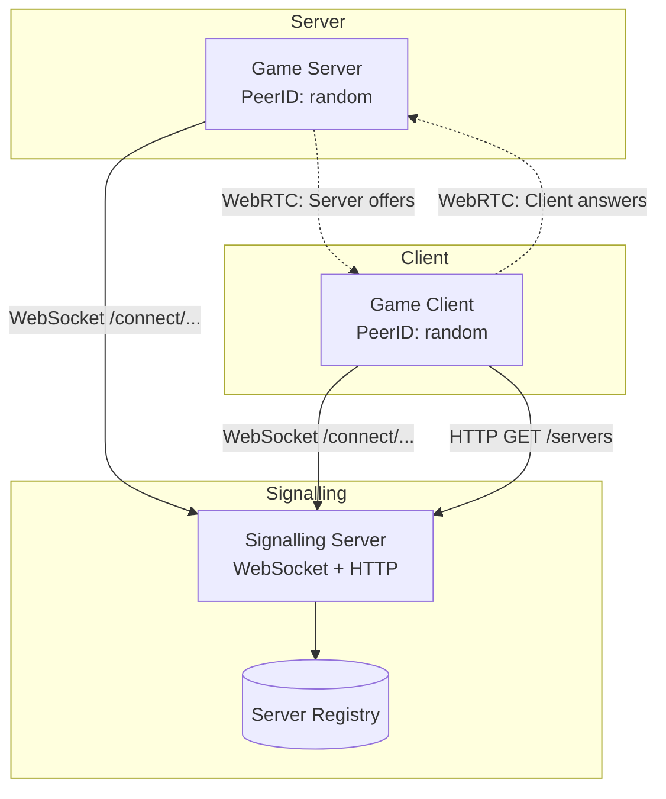
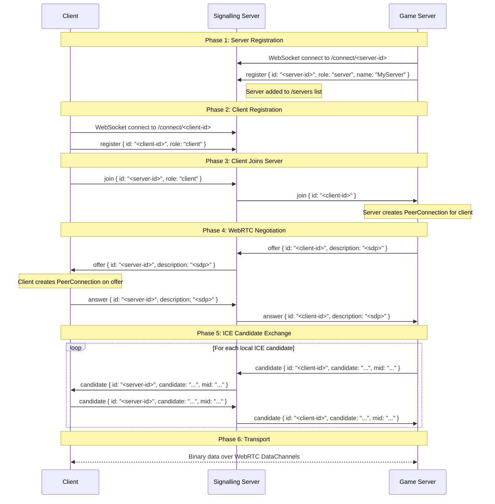
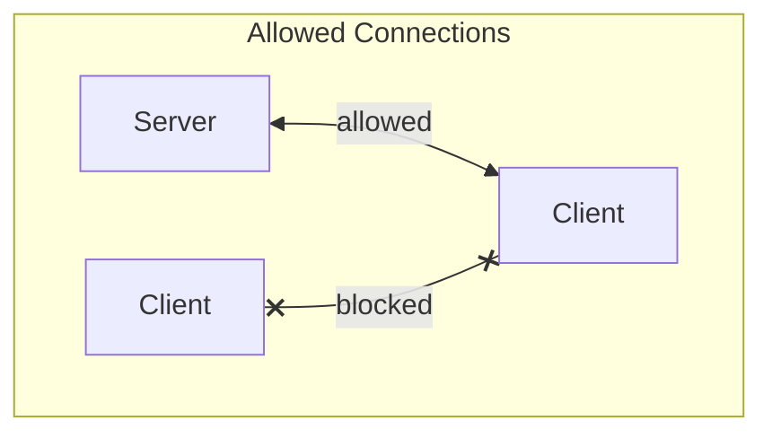

# Signalling Server Architecture

## Overview

The signalling server is a Go-based WebSocket relay that facilitates WebRTC connections between game clients and game servers. It uses a role-based registration system to control which peers can connect to each other.

**Key properties:**
- Game servers are publicly discoverable via HTTP `/servers` endpoint
- Clients are hidden (never listed)
- Client-to-client connections are blocked
- Servers act as the offeror, but are triggered by `join` signals from the client
- WebRTC data channels provide low-latency transport after signalling

## Architecture Diagram



## Registration Protocol

### Message Format

All messages are JSON-encoded. The `id` field is used for both sender identification (in outgoing messages from signalling server) and target identification (in incoming messages to signalling server).

**Registration (first message after WebSocket connect):**
```json
{
  "type": "register",
  "id": "unique-peer-id",
  "role": "client" | "server",
  "name": "server-name",         // optional, server only
  "max_players": 32,             // optional, server only
  "game_mode": "default"         // optional, server only
}
```

**Join (client requests to join a server):**
```json
{
  "type": "join",
  "id": "server-peer-id",
  "role": "client"
}
```

**Offer/Answer (SDP exchange):**
```json
{
  "type": "offer" | "answer",
  "id": "target-peer-id",
  "description": "sdp-string"
}
```

**Candidate (ICE candidate):**
```json
{
  "type": "candidate",
  "id": "target-peer-id",
  "candidate": "ice-candidate-string",
  "mid": "media-stream-id"
}
```

### Connection Flow



### Access Control Rules



**Validation logic (in `handleConnection`):**
- Client-to-client offers are rejected
- Client-to-server offers are allowed
- Server-to-client offers are allowed (though servers don't initiate in current implementation)
- All peers must be registered before sending (except `register` itself)

## Signalling Server Components

### PeerManager

Manages all connected peers and routing:

```go
type PeerInfo struct {
    conn  *websocket.Conn
    role  PeerRole  // RoleClient or RoleServer
}

type PeerManager struct {
    peers   map[string]*PeerInfo  // id → peer info
    servers []string              // list of server IDs
    maxConns int                  // connection limit (0 = unlimited)
}
```

**Key methods:**
- `Register(id, conn, role)` - Registers a peer, returns error if ID exists or max connections reached
- `Unregister(id)` - Removes peer and closes connection
- `Get(id)` - Retrieves peer info by ID
- `GetRole(id)` - Returns peer's role (client/server)
- `GetServerList()` - Returns copy of all server IDs (for `/servers` endpoint)

### Message Routing

The signalling server rewrites the `id` field when forwarding messages:
- **Incoming**: `id` = target peer ID
- **Outgoing**: `id` = sender peer ID

This allows receivers to know who sent the message without an explicit `sender_id` field.

### HTTP Endpoints

| Endpoint | Method | Description |
|----------|--------|-------------|
| `/health` | GET | Health check |
| `/stats` | GET | Connections count (JSON: `{"connections": N}`) |
| `/servers` | GET | Returns JSON array of registered server IDs |
| `/connect/{peer-id}` | GET, WS | WebSocket signalling endpoint (peer-id in URL path) |
